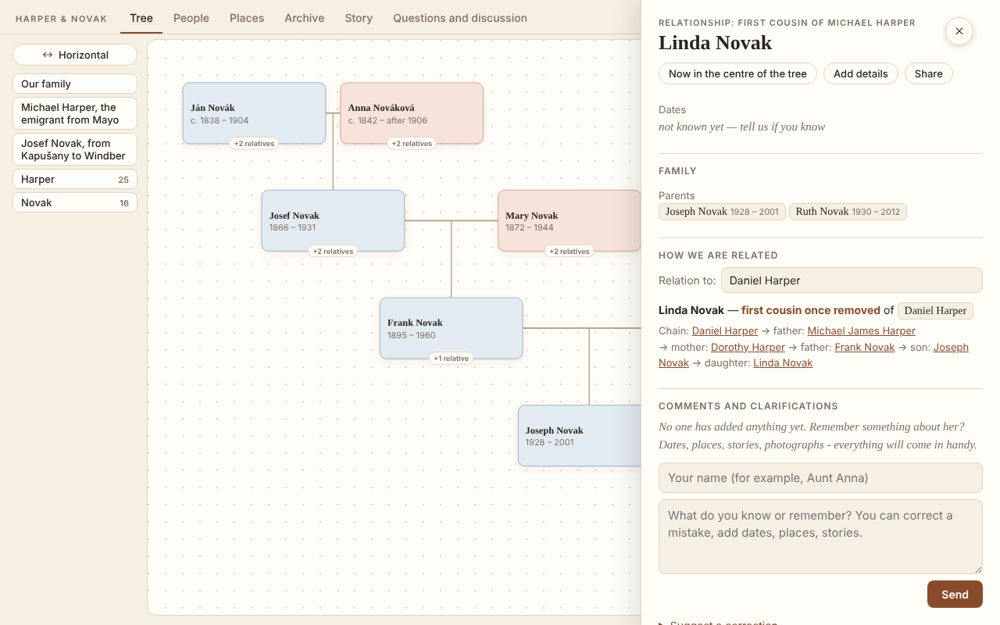
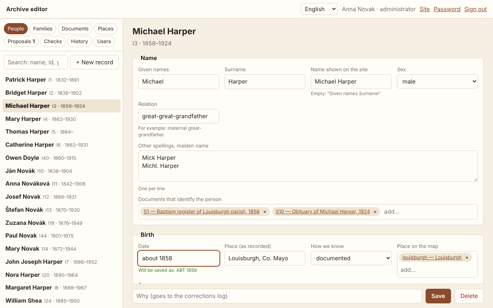
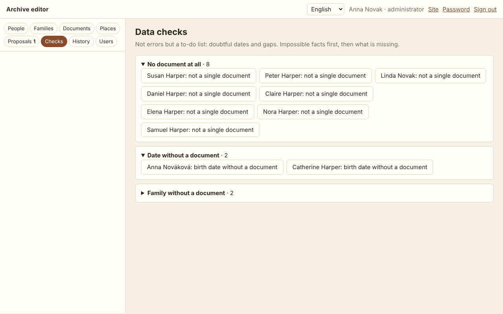
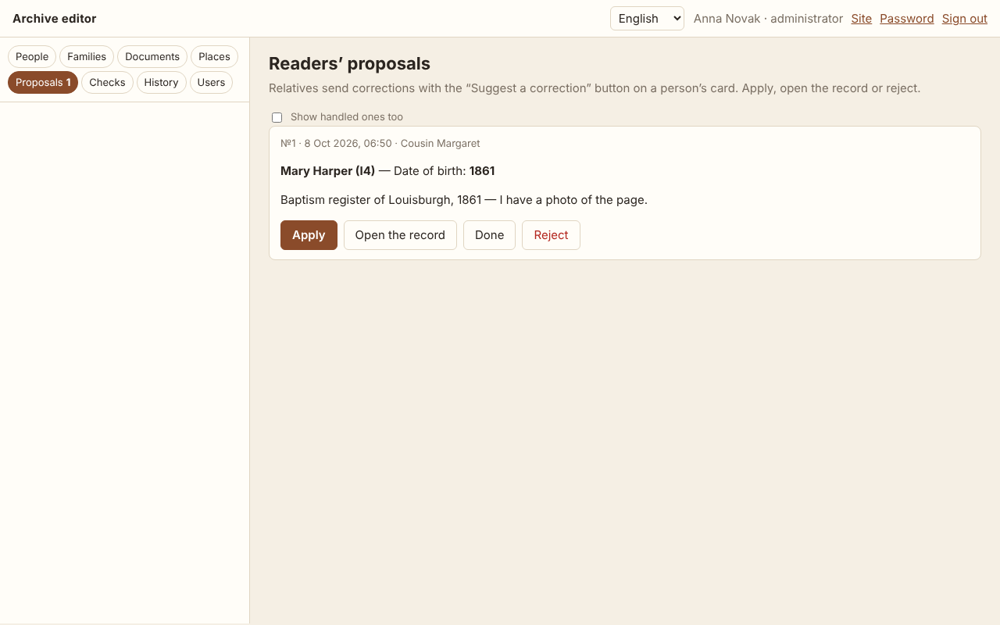

<div align="center">

# gene-archive

### Your family's history as a website — every fact backed by its document.

[](https://github.com/igormel81/gene_archive/releases)
[](https://github.com/igormel81/gene_archive/actions/workflows/ci.yml)
[](LICENSE)


**[▶ Live demo](https://igormel81.github.io/gene_archive/)** ·
**[Quick start](#quick-start)** ·
**[Documentation](#documentation)** ·
**[Русская версия](README.ru.md)**

</div>

Scans in shoeboxes, dates in a grandmother's notebook, a tree in MyHeritage, stories that
only one aunt still remembers. **gene-archive** gathers all of it into one beautiful website
your whole family can open on a phone: an interactive tree, a card for every person with the
documents behind each date, an archive of scans with transcriptions, a map of family places
and the story of the family — in English, Russian and Romanian.

Relatives don't just read it. They leave comments, suggest corrections and, with an account,
edit the archive right in the browser. You keep everything: one JSON file, your own domain,
free hosting, full history in git, GEDCOM in and out.


> Grew out of a real family archive: ~550 people, ~500 documents, three countries, relatives
> commenting in three languages. The [demo](https://igormel81.github.io/gene_archive/) is a
> fictional family made to show every feature.

## Why gene-archive

|   |   |
|---|---|
| 📜 **Proof for every fact** | Each date and place shows where it comes from — a document, a family story, a calculation from an age — and `S12` in any text opens the scan. Doubtful links are drawn dashed, not hidden. |
| 👨‍👩‍👧 **Made for the whole family** | Relatives read it like a book, find themselves in the tree, ask "how are we related?", comment and suggest corrections — no registration on a platform. |
| ✏️ **Edit in the browser** | Accounts for editors and administrators, checks before every save, nobody overwrites anybody, every change is a git commit you can undo. |
| 🔒 **Private by default** | Living people show only their names — no dates, places or documents, not even in the data file or the GEDCOM export. |
| 🏠 **Your data, your site** | One JSON file, plain HTML, free hosting on GitHub Pages or Netlify, or your own server. No subscription, no lock-in: GEDCOM import and export. |
| 🌍 **Three languages** | English, Russian and Romanian interface out of the box; your own texts can be translated too. |
| 🤖 **AI-ready** | Every new site gets `AGENTS.md` for Claude Code and Codex, plus guides and ready prompts for research in archives and open sources. |

## Features

### 🌳 Tree, people and "How we are related"

- **Hourglass tree** around any person, a whole-tree chart, export to PNG, branches by surname.
- **Person card**: dates and places with their documents, alternative versions of a date,
  relatives, a connected life story.
- **How we are related**: the exact relation between any two people — *second cousin once
  removed*, *great-uncle*, *half-brother*, in-laws — with the chain of people in between.
  In Russian and Romanian too, with their own kinship terms.
- **People**: search, a calendar of birthdays and anniversaries, surname pages, the zodiac.



### 🗂 Archive of documents

- Every scan and photograph with a transcription, the back of a photo, PDF previews.
- Filters by type of document and by family line; restored photos next to originals.
- A research log ("where we searched and what we found") and a log of corrections.

| | |
|---|---|
|  |  |

### 🗺 Places and the family story

- A map (Leaflet + OpenStreetMap) with family branches, moves between places,
  "then and now" names and timelines.
- The **Story** page: your narrative with a timeline and a "by place" filter.
- **Questions to relatives**: what the family does not know yet — answered right on the site.

### ✏️ Online editor

- People, families, documents (with scan uploads) and places in a browser — on a phone too.
- Dates the way people write them: "about 1899", "between 1900 and 1905", "9.10.1899".
- A change that would break the data is not saved; the editor says what is wrong.
- Two people editing the same record? The second one is warned instead of overwriting.
- Every change goes to the corrections log and becomes a git commit by its author;
  an administrator can restore any version.
- **Suggest a correction**: readers send a fix from a person's card; an administrator
  applies it in one click.



### 🔎 Research assistant

- **Data checks** (`gene hints` and the editor's "Checks" tab): impossible facts first — born
  after the mother's death, a parent aged 11 — then gaps: no dates, a date without a document,
  people not connected to the tree, documents nobody refers to.
- A step-by-step **research guide** and ready **AI prompts** for archives and open sources.

| | |
|---|---|
|  |  |

### 🚀 Publish anywhere

- `gene build` → plain HTML for GitHub Pages, Netlify, Cloudflare Pages or any web server.
- `gene serve` or the Docker image adds comments, a PIN for a private archive and the editor.
- Search engines find every person and surname: static pages, sitemap, Schema.org;
  living people are `noindex`.

## How it compares

| | gene-archive | Platforms (MyHeritage, Ancestry…) | Self-hosted apps (webtrees, Gramps Web) |
|---|:-:|:-:|:-:|
| Your own site and domain | ✓ | — | ✓ |
| Free static hosting, no database | ✓ | — | — |
| Free, open source | ✓ (MIT) | subscription | ✓ |
| A document behind every fact, on the page | ✓ | partly | partly |
| Story, map and archive in one site | ✓ | partly | partly |
| Relatives comment and suggest corrections | ✓ | ✓ | partly |
| Editing in a browser with roles and history | ✓ | ✓ | ✓ |
| DNA matches, hints from billions of records | — | ✓ | — |

gene-archive does not try to be a database of the world's records. It is the place where
**your** family's evidence and stories live — and where your relatives actually look.

## Quick start

You need Python 3.10+. [Pillow](https://pypi.org/project/Pillow/) makes thumbnails
(optional), `pdftoppm` from poppler-utils makes PDF previews (optional).

```sh
pip install "gene-archive[images] @ git+https://github.com/igormel81/gene_archive"

gene init my-family --example     # a copy of the demo family to look around
gene serve my-family              # → http://127.0.0.1:8111
```

Start your own archive:

```sh
gene init my-family --lang en     # an empty site: family_tree.json + site.json
gene import tree.ged my-family    # …or start from a GEDCOM file
gene validate my-family           # check the data
gene build my-family              # the site is in my-family/_site
```

Then fill in `family_tree.json` (people, families, documents, places — see
[the data format](docs/data-format.md)) and `site.json` ([settings](docs/configuration.md)),
put scans into `sources/`, and write the story in `content/story.html`
([content pages](docs/content.md)).

**New to genealogy?** Read [How to start researching your family history](docs/research-guide.md):
interviews, home documents, online databases, archives, evidence and how to record it.

## Quick start with an AI assistant

Works in any AI coding environment — Claude Code, Codex, Cursor, GitHub Copilot, Windsurf, Gemini CLI.
Open an empty folder in it and paste:

```text
Set up a family archive site with gene-archive (https://github.com/igormel81/gene_archive) in this folder.
1. Install it: pip install "gene-archive[images] @ git+https://github.com/igormel81/gene_archive"
2. Create the site: gene init . --lang en (or gene import <my file>.ged . if I give you a GEDCOM file),
   then git init and a first commit.
3. Read AGENTS.md and follow it in all further work: never invent facts or relationships,
   cite a document for every fact, keep doubtful things as leads.
4. Ask me about the family (my parents, grandparents, what documents and photos we have at home)
   and fill family_tree.json and site.json from my answers.
5. Run gene validate and gene serve ., give me the link and show what you changed.
```

Then just talk to it: "here is a scan of my grandfather's birth certificate", "my aunt says…".
More ready-made requests and the rules for reviewing the agent's work:
[docs/ai-assistants.md](docs/ai-assistants.md).

## Documentation

| | English | Русский |
|---|---|---|
| How to start the research | [research-guide.md](docs/research-guide.md) | [research-guide.ru.md](docs/research-guide.ru.md) |
| AI requests for research in open sources and archives | [research-prompts.md](docs/research-prompts.md) | [research-prompts.ru.md](docs/research-prompts.ru.md) |
| Filling the site with Claude or Codex | [ai-assistants.md](docs/ai-assistants.md) | [ai-assistants.ru.md](docs/ai-assistants.ru.md) |
| Data format (`family_tree.json`) | [data-format.md](docs/data-format.md) | [data-format.ru.md](docs/data-format.ru.md) |
| Settings (`site.json`) | [configuration.md](docs/configuration.md) | [configuration.ru.md](docs/configuration.ru.md) |
| Story, biographies, news | [content.md](docs/content.md) | [content.ru.md](docs/content.ru.md) |
| Languages and translations | [translations.md](docs/translations.md) | [translations.ru.md](docs/translations.ru.md) |
| Publishing: GitHub Pages, server, Docker, comments | [deploy.md](docs/deploy.md) | [deploy.ru.md](docs/deploy.ru.md) |
| Online editor: accounts, history, readers' proposals | [editor.md](docs/editor.md) | [editor.ru.md](docs/editor.ru.md) |
| Contributing to the engine | [CONTRIBUTING.md](CONTRIBUTING.md) | [CONTRIBUTING.ru.md](CONTRIBUTING.ru.md) |

## Commands

| Command | What it does |
|---|---|
| `gene init <folder> [--lang ru\|en\|ro] [--example]` | a new site (or a copy of the demo) |
| `gene import tree.ged <folder> [--root @I12@]` | a new site from GEDCOM |
| `gene validate [folder]` | errors and warnings in the data |
| `gene build [folder] [-o out] [--base-url URL]` | build the static site |
| `gene serve [folder] [--pin 1234] [--moderate]` | build and serve with comments |
| `gene serve <folder> --editor` | … and the online editor at `/edit/` |
| `gene users <folder> add NAME [--role admin] \| invite \| list \| role \| disable \| passwd` | editor accounts |
| `gene comments <folder> list\|approve ID\|hide ID\|done ID "note"` | moderate comments |
| `gene gedcom [folder] [-o file.ged] [--version 5.5.1\|7.0]` | GEDCOM for MyHeritage, Ancestry, Gramps… (`--full`: with living people, for your own backup) |
| `gene translations <folder> <lang>` | your texts that have no translation yet |
| `gene hints [folder] [--json]` | gaps and doubtful facts — a to-do list for the research |

Messages are in Russian when the system language is Russian (or `GENE_LANG=ru`).

## License

[MIT](LICENSE). Leaflet is BSD-licensed, map tiles © OpenStreetMap contributors — see
[THIRD_PARTY.md](THIRD_PARTY.md).
