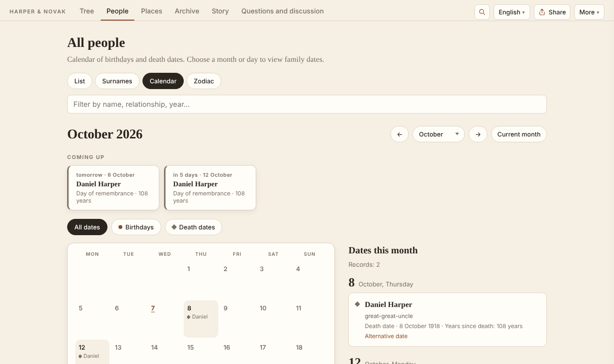

# gene-archive

**[Русская версия](README.ru.md)**

A static site generator for a family history archive. It turns one JSON file with
people, families, documents and places into a website that relatives can actually use:
an interactive tree, a card for every person, an archive of scans and photographs with
transcriptions, a map of family places, a narrative story, questions to relatives, and
pages that search engines can find.

The interface is in **English, Russian and Romanian**; your own texts can be translated
too. Living people are hidden automatically. The result is plain HTML that can be hosted
for free on GitHub Pages, Netlify or any web server; an optional small server adds
comments from relatives.


The engine grew out of a real family archive with ~550 people, ~500 documents and
relatives commenting in three languages. The demo in [`example/`](example/) is a
fictional family made to show every feature.

## What you get

- **Tree** — an hourglass around any person, with dashed lines for probable links,
  a whole-tree chart, export to PNG, surname lines.
- **Person cards** — dates and places with the documents behind them, alternative versions
  of a date, relatives, a connected life story where `S12` becomes a link to the document.
- **Archive** — every scan and photo with a transcription, the back side of a photo, PDF
  previews, filters by type and line, a research log and a log of corrections.
- **Places** — a map (Leaflet + OpenStreetMap) with family branches, moves between places,
  "then and now" names, timelines.
- **People** — a searchable list, a calendar of birthdays and anniversaries, surname pages.
- **Story** — your narrative with a timeline and a "by place" filter.
- **Questions** — what the family does not know yet; relatives answer on the site
  (with the comments server).
- **Search engines** — a static page for every person and surname, sitemap, Schema.org;
  living people are `noindex`.
- **Privacy** — living people show only their names: no dates, places, notes or documents,
  not even in the data file or the GEDCOM export. Documents the family asked to remove
  (`"hidden": true`) never leave your computer.
- **GEDCOM** — import from MyHeritage, Gramps, Ancestry, Geni…; export for the same programs.

| | |
|---|---|
|  |  |

## Quick start

You need Python 3.10+. [Pillow](https://pypi.org/project/Pillow/) makes thumbnails
(optional), `pdftoppm` from poppler-utils makes PDF previews (optional).

```sh
pip install "gene-archive[images] @ git+https://github.com/igormel81/gene_archive"

gene init my-family --example     # a copy of the demo family to look around
gene serve my-family              # → http://127.0.0.1:8111
```

Start your own archive:

```sh
gene init my-family --lang en     # an empty site: family_tree.json + site.json
gene import tree.ged my-family    # …or start from a GEDCOM file
gene validate my-family           # check the data
gene build my-family              # the site is in my-family/_site
```

Then fill in `family_tree.json` (people, families, documents, places — see
[the data format](docs/data-format.md)) and `site.json` ([settings](docs/configuration.md)),
put scans into `sources/`, and write the story in `content/story.html`
([content pages](docs/content.md)).

**New to genealogy?** Read [How to start researching your family history](docs/research-guide.md):
interviews, home documents, online databases, archives, evidence and how to record it.

## Documentation

| | English | Русский |
|---|---|---|
| How to start the research | [research-guide.md](docs/research-guide.md) | [research-guide.ru.md](docs/research-guide.ru.md) |
| Data format (`family_tree.json`) | [data-format.md](docs/data-format.md) | [data-format.ru.md](docs/data-format.ru.md) |
| Settings (`site.json`) | [configuration.md](docs/configuration.md) | [configuration.ru.md](docs/configuration.ru.md) |
| Story, biographies, news | [content.md](docs/content.md) | [content.ru.md](docs/content.ru.md) |
| Languages and translations | [translations.md](docs/translations.md) | [translations.ru.md](docs/translations.ru.md) |
| Publishing: GitHub Pages, server, Docker, comments | [deploy.md](docs/deploy.md) | [deploy.ru.md](docs/deploy.ru.md) |
| Contributing to the engine | [CONTRIBUTING.md](CONTRIBUTING.md) | [CONTRIBUTING.ru.md](CONTRIBUTING.ru.md) |

## Commands

| Command | What it does |
|---|---|
| `gene init <folder> [--lang ru\|en\|ro] [--example]` | a new site (or a copy of the demo) |
| `gene import tree.ged <folder> [--root @I12@]` | a new site from GEDCOM |
| `gene validate [folder]` | errors and warnings in the data |
| `gene build [folder] [-o out] [--base-url URL]` | build the static site |
| `gene serve [folder] [--pin 1234] [--moderate]` | build and serve with comments |
| `gene comments <folder> list\|approve ID\|hide ID\|done ID "note"` | moderate comments |
| `gene translations <folder> <lang>` | your texts that have no translation yet |

Messages are in Russian when the system language is Russian (or `GENE_LANG=ru`).

## License

[MIT](LICENSE). Leaflet is BSD-licensed, map tiles © OpenStreetMap contributors — see
[THIRD_PARTY.md](THIRD_PARTY.md).
