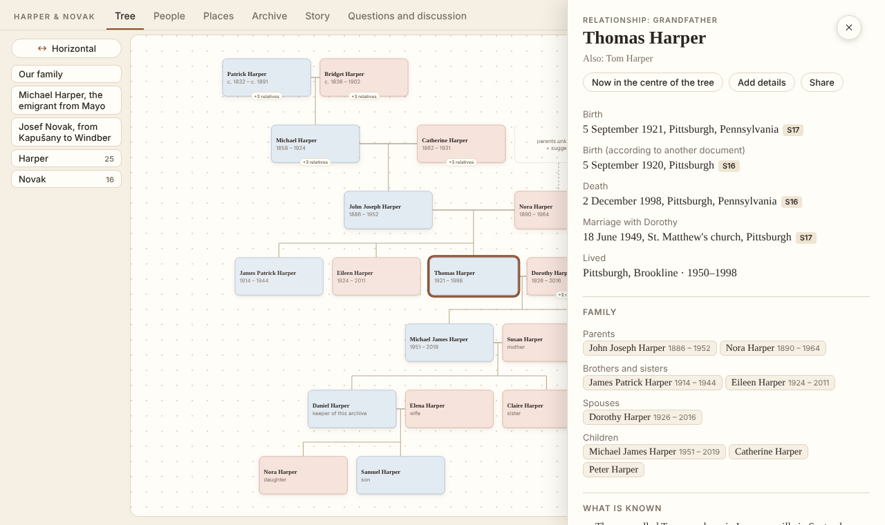
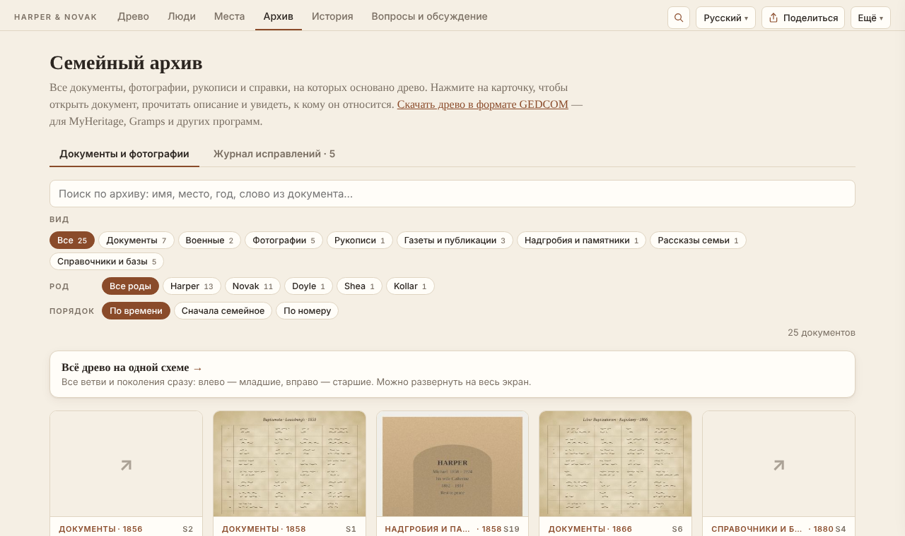
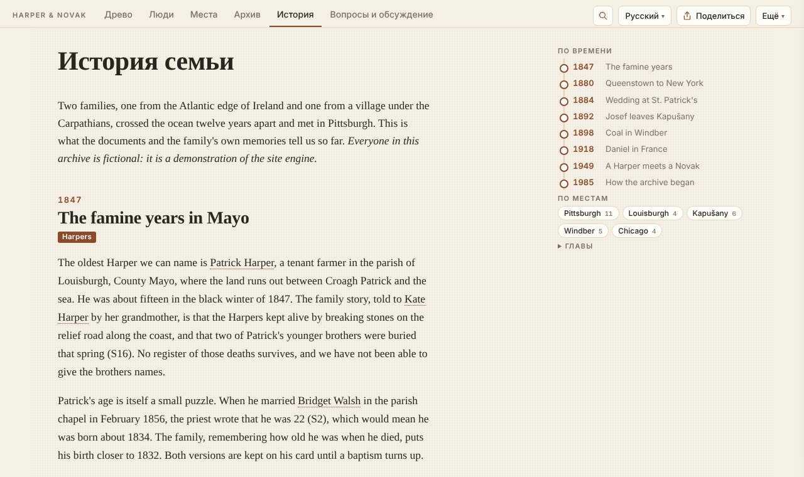

# gene-archive

**[English version](README.md)**

Генератор сайта семейного архива. Один JSON-файл с людьми, семьями, документами
и местами превращается в сайт, которым удобно пользоваться родственникам: интерактивное
древо, карточка каждого человека, архив сканов и фотографий с расшифровками, карта мест
семьи, связный рассказ, вопросы к родным и страницы, которые находят поисковики.

Интерфейс — **на русском, английском и румынском**; ваши тексты тоже можно перевести.
Живые люди скрываются автоматически. Результат — обычный HTML: его можно бесплатно
разместить на GitHub Pages, Netlify или любом веб-сервере, а небольшой сервер из
комплекта добавляет комментарии родственников.



Движок вырос из настоящего семейного архива: около 550 человек, 500 документов,
родственники пишут комментарии на трёх языках. Пример в [`example/`](example/) —
вымышленная семья, на которой видны все возможности.

## Что получится

- **Древо** — «песочные часы» вокруг любого человека, пунктир для вероятного родства,
  всё древо на одной схеме, сохранение картинкой, ветви по фамилиям.
- **Карточка человека** — даты и места с документами, на которых они основаны, разные
  версии одной даты, родные, связный рассказ о жизни, где `S12` — ссылка на документ.
- **Архив** — каждый скан и снимок с расшифровкой, оборот фотографии, превью PDF, фильтры
  по виду и роду, журнал поиска и журнал исправлений.
- **Места** — карта (Leaflet + OpenStreetMap) с ветвями семьи, переездами, названиями
  «тогда и сейчас», хронологией.
- **Люди** — список с поиском, календарь дней рождения и памяти, страницы фамилий.
- **История** — ваш рассказ с лентой времени и фильтром «по местам».
- **Вопросы** — что семья пока не знает; родные отвечают прямо на сайте (с сервером комментариев).
- **Поисковики** — отдельная страница на каждого человека и фамилию, sitemap, Schema.org;
  живые — `noindex`.
- **Приватность** — о живых людях публикуется только имя: без дат, мест, заметок и документов,
  даже в файле данных и в выгрузке GEDCOM. Документы, которые семья попросила убрать
  (`"hidden": true`), не покидают ваш компьютер.
- **GEDCOM** — импорт из MyHeritage, Gramps, Ancestry, Geni…; выгрузка для тех же программ.

| | |
|---|---|
|  |  |

## Быстрый старт

Нужен Python 3.10+. [Pillow](https://pypi.org/project/Pillow/) делает превью снимков
(необязательно), `pdftoppm` из poppler-utils — превью PDF (необязательно).

```sh
pip install "gene-archive[images] @ git+https://github.com/igormel81/gene_archive"

gene init my-family --example     # копия демонстрационной семьи, чтобы осмотреться
gene serve my-family              # → http://127.0.0.1:8111
```

Свой архив:

```sh
gene init my-family --lang ru     # пустой сайт: family_tree.json + site.json
gene import tree.ged my-family    # …или начать с файла GEDCOM
gene validate my-family           # проверить данные
gene build my-family              # сайт — в папке my-family/_site
```

Дальше заполните `family_tree.json` (люди, семьи, документы, места — см.
[формат данных](docs/data-format.ru.md)) и `site.json` ([настройки](docs/configuration.ru.md)),
сложите сканы в `sources/`, а рассказ напишите в `content/story.html`
([страницы с текстом](docs/content.ru.md)).

**Только начинаете?** Прочитайте [Как начать искать историю своей семьи](docs/research-guide.ru.md):
расспросы родных, домашний архив, базы в интернете, архивы, проверка находок и как их записывать.

## Быстрый старт с ИИ-помощником

Подходит любая среда ИИ-разработки — Claude Code, Codex, Cursor, GitHub Copilot, Windsurf, Gemini CLI.
Откройте в ней пустую папку и вставьте:

```text
Создай в этой папке сайт семейного архива на движке gene-archive (https://github.com/igormel81/gene_archive).
1. Установи: pip install "gene-archive[images] @ git+https://github.com/igormel81/gene_archive"
2. Создай сайт: gene init . --lang ru (или gene import <мой файл>.ged . — если я дам файл GEDCOM),
   затем git init и первый коммит.
3. Прочитай AGENTS.md и следуй ему во всей дальнейшей работе: не выдумывай факты и родство,
   у каждого факта — документ, сомнительное — в наводки.
4. Расспроси меня о семье (родители, бабушки и дедушки, какие документы и фотографии есть дома)
   и по моим ответам заполни family_tree.json и site.json.
5. Запусти gene validate и gene serve ., дай мне ссылку и покажи, что ты изменил.
```

Дальше просто разговаривайте: «вот скан свидетельства о рождении деда», «тётя рассказывает, что…».
Другие готовые запросы и как проверять работу агента —
[docs/ai-assistants.ru.md](docs/ai-assistants.ru.md).

## Документация

| | Русский | English |
|---|---|---|
| С чего начать поиск | [research-guide.ru.md](docs/research-guide.ru.md) | [research-guide.md](docs/research-guide.md) |
| Запросы к ИИ для поиска в открытых источниках и архивах | [research-prompts.ru.md](docs/research-prompts.ru.md) | [research-prompts.md](docs/research-prompts.md) |
| Как наполнять сайт с помощью Claude или Codex | [ai-assistants.ru.md](docs/ai-assistants.ru.md) | [ai-assistants.md](docs/ai-assistants.md) |
| Формат данных (`family_tree.json`) | [data-format.ru.md](docs/data-format.ru.md) | [data-format.md](docs/data-format.md) |
| Настройки (`site.json`) | [configuration.ru.md](docs/configuration.ru.md) | [configuration.md](docs/configuration.md) |
| История, биографии, новости | [content.ru.md](docs/content.ru.md) | [content.md](docs/content.md) |
| Языки и переводы | [translations.ru.md](docs/translations.ru.md) | [translations.md](docs/translations.md) |
| Публикация: GitHub Pages, сервер, Docker, комментарии | [deploy.ru.md](docs/deploy.ru.md) | [deploy.md](docs/deploy.md) |
| Как участвовать в разработке | [CONTRIBUTING.ru.md](CONTRIBUTING.ru.md) | [CONTRIBUTING.md](CONTRIBUTING.md) |

## Команды

| Команда | Что делает |
|---|---|
| `gene init <папка> [--lang ru\|en\|ro] [--example]` | новый сайт (или копия примера) |
| `gene import tree.ged <папка> [--root @I12@]` | новый сайт из GEDCOM |
| `gene validate [папка]` | ошибки и предупреждения в данных |
| `gene build [папка] [-o куда] [--base-url адрес]` | собрать сайт |
| `gene serve [папка] [--pin 1234] [--moderate]` | собрать и запустить с комментариями |
| `gene comments <папка> list\|approve N\|hide N\|done N "что сделано"` | модерация комментариев |
| `gene gedcom [папка] [-o файл.ged] [--version 5.5.1\|7.0]` | GEDCOM для MyHeritage, Ancestry, Gramps… (`--full` — с живыми, для своей резервной копии) |
| `gene translations <папка> <язык>` | ваши тексты, у которых ещё нет перевода |

Сообщения команд — по-русски, если язык системы русский (или `GENE_LANG=ru`).

## Лицензия

[MIT](LICENSE). Leaflet — лицензия BSD, подложка карты © участники OpenStreetMap —
см. [THIRD_PARTY.md](THIRD_PARTY.md).
