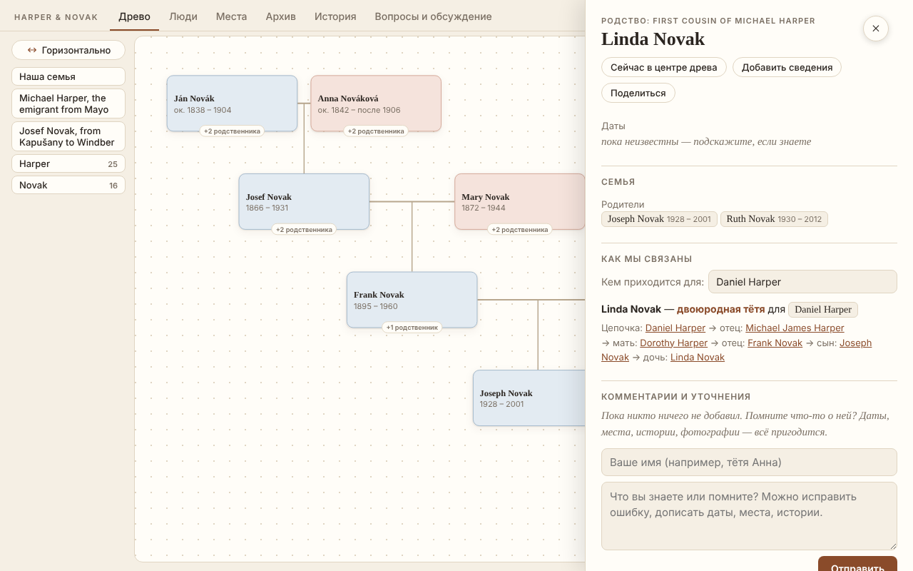
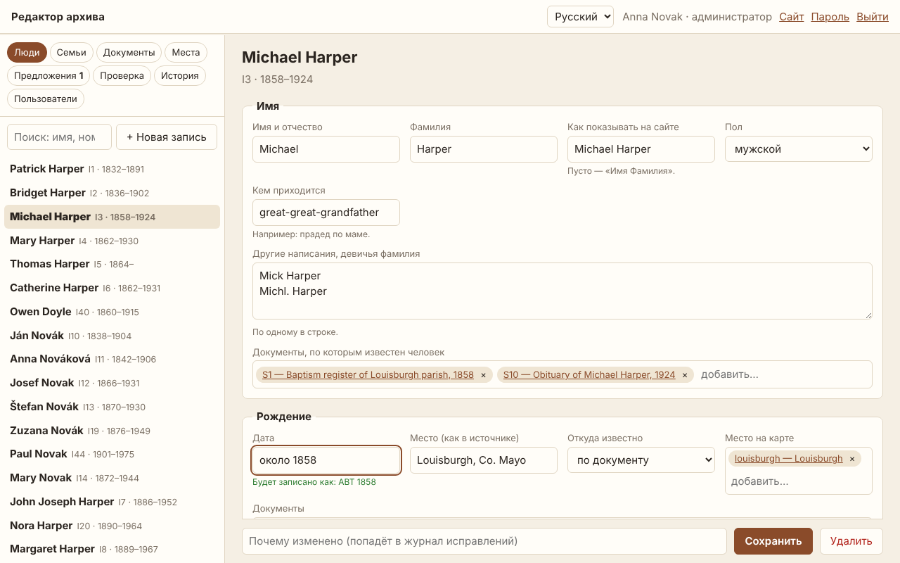
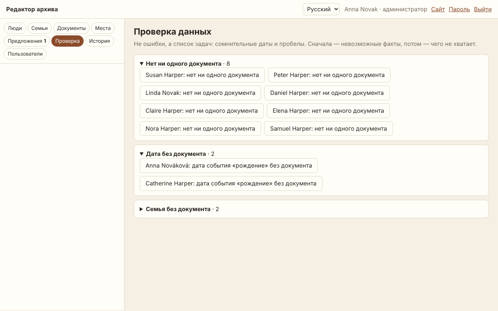
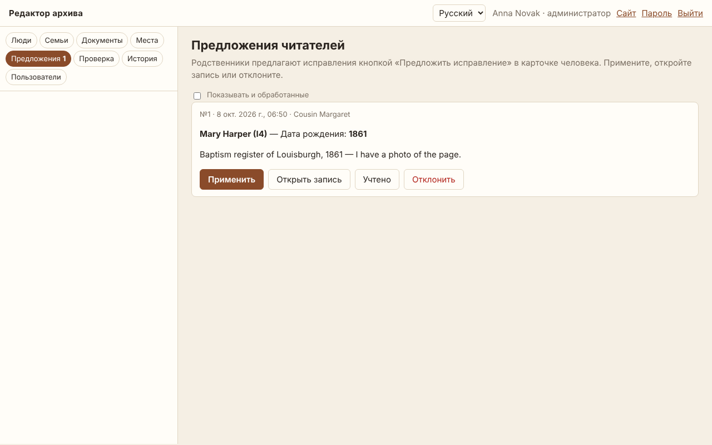

<div align="center">

# gene-archive

### История вашей семьи — сайтом, где у каждого факта есть документ.

[](https://github.com/igormel81/gene_archive/releases)
[](https://github.com/igormel81/gene_archive/actions/workflows/ci.yml)
[](LICENSE)


**[▶ Живое демо](https://igormel81.github.io/gene_archive/ru/)** ·
**[Быстрый старт](#быстрый-старт)** ·
**[Документация](#документация)** ·
**[English version](README.md)**

</div>

Сканы в коробке из-под обуви, даты в бабушкиной тетради, древо на MyHeritage, истории, которые
помнит только одна тётя. **gene-archive** собирает всё это в один красивый сайт, который вся
семья откроет с телефона: интерактивное древо, карточка каждого человека с документами за каждой
датой, архив сканов с расшифровками, карта мест семьи и её история — на русском, английском
и румынском.

Родные его не только читают: пишут комментарии, предлагают исправления, а с учётной записью —
правят архив прямо в браузере. Всё остаётся у вас: один JSON-файл, свой адрес, бесплатный
хостинг, вся история правок в git, GEDCOM туда и обратно.


> Вырос из настоящего семейного архива: около 550 человек, 500 документов, три страны,
> родственники пишут на трёх языках. [Демо](https://igormel81.github.io/gene_archive/ru/) —
> вымышленная семья, на которой видны все возможности.

## Почему gene-archive

|   |   |
|---|---|
| 📜 **У каждого факта — доказательство** | У каждой даты и места видно, откуда они: документ, рассказ семьи, расчёт по возрасту, — а `S12` в любом тексте открывает скан. Сомнительное родство рисуется пунктиром, а не прячется. |
| 👨‍👩‍👧 **Для всей семьи** | Родные читают сайт как книгу, находят себя в древе, узнают, кем приходятся друг другу, пишут комментарии и предлагают исправления — без регистрации на платформах. |
| ✏️ **Правка в браузере** | Учётные записи редакторов и администраторов, проверка перед каждым сохранением, никто не затрёт чужую правку, каждое изменение — коммит в git, который можно отменить. |
| 🔒 **Приватность по умолчанию** | О живых людях публикуется только имя: без дат, мест и документов — даже в файле данных и в выгрузке GEDCOM. |
| 🏠 **Ваши данные — ваш сайт** | Один JSON-файл, обычный HTML, бесплатный хостинг на GitHub Pages или Netlify либо свой сервер. Без подписки и без привязки: импорт и выгрузка GEDCOM. |
| 🌍 **Три языка** | Интерфейс на русском, английском и румынском из коробки; ваши тексты тоже можно перевести. |
| 🤖 **Готов к работе с ИИ** | В каждый новый сайт кладётся `AGENTS.md` для Claude Code и Codex, а ещё — инструкции и готовые запросы для поиска в архивах и открытых источниках. |

## Возможности

### 🌳 Древо, люди и «Как мы связаны»

- **Древо «песочными часами»** вокруг любого человека, всё древо на одной схеме, сохранение
  картинкой, ветви по фамилиям.
- **Карточка человека**: даты и места с документами, разные версии одной даты, родные,
  связный рассказ о жизни.
- **Как мы связаны**: точное родство любых двух людей — *троюродный дядя*, *двоюродная бабушка*,
  *единокровный брат*, свойственники — и цепочка людей между ними. По-английски и по-румынски —
  своими словами.
- **Люди**: поиск, календарь дней рождения и памяти, страницы фамилий, знаки зодиака.



### 🗂 Архив документов

- Каждый скан и снимок с расшифровкой, оборот фотографии, превью PDF.
- Фильтры по виду документа и по роду; отреставрированные снимки рядом с оригиналами.
- Журнал поиска («где искали и что нашли») и журнал исправлений.

| | |
|---|---|
|  |  |

### 🗺 Места и история семьи

- Карта (Leaflet + OpenStreetMap) с ветвями семьи, переездами, названиями «тогда и сейчас»
  и хронологией.
- Раздел **История**: ваш рассказ с лентой времени и фильтром «по местам».
- **Вопросы к родным**: чего семья пока не знает — ответы прямо на сайте.

### ✏️ Онлайн-редактор

- Люди, семьи, документы (с загрузкой сканов) и места в браузере — и с телефона тоже.
- Даты как пишут люди: «около 1899», «между 1900 и 1905», «9.10.1899».
- Правка, которая сломает данные, не сохранится — редактор скажет, что не так.
- Двое правят одну запись? Второй получит предупреждение, а не затрёт чужое.
- Каждое изменение — строка в журнале исправлений и коммит от имени автора; администратор
  может вернуть любую версию.
- **Предложить исправление**: читатель отправляет поправку из карточки человека, администратор
  применяет её одной кнопкой.



### 🔎 Помощник в поиске

- **Проверка данных** (`gene hints` и вкладка «Проверка» в редакторе): сначала невозможные
  факты — родился после смерти матери, родителю 11 лет, — потом пробелы: нет дат, дата без
  документа, человек не связан с древом, документ ни к кому не привязан.
- Пошаговое **руководство по поиску** и готовые **запросы к ИИ** для архивов и открытых источников.

| | |
|---|---|
|  |  |

### 🚀 Публикация где угодно

- `gene build` → обычный HTML для GitHub Pages, Netlify, Cloudflare Pages или любого веб-сервера.
- `gene serve` или Docker-образ добавляют комментарии, PIN для закрытого архива и редактор.
- Поисковики находят каждого человека и каждую фамилию: отдельные страницы, sitemap, Schema.org;
  живые — `noindex`.

## Чем отличается

| | gene-archive | Платформы (MyHeritage, Ancestry…) | Свои серверы (webtrees, Gramps Web) |
|---|:-:|:-:|:-:|
| Свой сайт и свой адрес | ✓ | — | ✓ |
| Бесплатный статический хостинг, без базы данных | ✓ | — | — |
| Бесплатно, открытый код | ✓ (MIT) | подписка | ✓ |
| Документ за каждым фактом прямо на странице | ✓ | отчасти | отчасти |
| История, карта и архив на одном сайте | ✓ | отчасти | отчасти |
| Родные комментируют и предлагают исправления | ✓ | ✓ | отчасти |
| Правка в браузере с ролями и историей | ✓ | ✓ | ✓ |
| ДНК-совпадения, подсказки из миллиардов записей | — | ✓ | — |

gene-archive не пытается стать базой всех записей мира. Это место, где живут документы
и истории **вашей** семьи — и куда ваши родные действительно заглядывают.

## Быстрый старт

Нужен Python 3.10+. [Pillow](https://pypi.org/project/Pillow/) делает превью снимков
(необязательно), `pdftoppm` из poppler-utils — превью PDF (необязательно).

```sh
pip install "gene-archive[images] @ git+https://github.com/igormel81/gene_archive"

gene init my-family --example     # копия демонстрационной семьи, чтобы осмотреться
gene serve my-family              # → http://127.0.0.1:8111
```

Свой архив:

```sh
gene init my-family --lang ru     # пустой сайт: family_tree.json + site.json
gene import tree.ged my-family    # …или начать с файла GEDCOM
gene validate my-family           # проверить данные
gene build my-family              # сайт — в папке my-family/_site
```

Дальше заполните `family_tree.json` (люди, семьи, документы, места — см.
[формат данных](docs/data-format.ru.md)) и `site.json` ([настройки](docs/configuration.ru.md)),
сложите сканы в `sources/`, а рассказ напишите в `content/story.html`
([страницы с текстом](docs/content.ru.md)).

**Только начинаете?** Прочитайте [Как начать искать историю своей семьи](docs/research-guide.ru.md):
расспросы родных, домашний архив, базы в интернете, архивы, проверка находок и как их записывать.

## Быстрый старт с ИИ-помощником

Подходит любая среда ИИ-разработки — Claude Code, Codex, Cursor, GitHub Copilot, Windsurf, Gemini CLI.
Откройте в ней пустую папку и вставьте:

```text
Создай в этой папке сайт семейного архива на движке gene-archive (https://github.com/igormel81/gene_archive).
1. Установи: pip install "gene-archive[images] @ git+https://github.com/igormel81/gene_archive"
2. Создай сайт: gene init . --lang ru (или gene import <мой файл>.ged . — если я дам файл GEDCOM),
   затем git init и первый коммит.
3. Прочитай AGENTS.md и следуй ему во всей дальнейшей работе: не выдумывай факты и родство,
   у каждого факта — документ, сомнительное — в наводки.
4. Расспроси меня о семье (родители, бабушки и дедушки, какие документы и фотографии есть дома)
   и по моим ответам заполни family_tree.json и site.json.
5. Запусти gene validate и gene serve ., дай мне ссылку и покажи, что ты изменил.
```

Дальше просто разговаривайте: «вот скан свидетельства о рождении деда», «тётя рассказывает, что…».
Другие готовые запросы и как проверять работу агента —
[docs/ai-assistants.ru.md](docs/ai-assistants.ru.md).

## Документация

| | Русский | English |
|---|---|---|
| С чего начать поиск | [research-guide.ru.md](docs/research-guide.ru.md) | [research-guide.md](docs/research-guide.md) |
| Запросы к ИИ для поиска в открытых источниках и архивах | [research-prompts.ru.md](docs/research-prompts.ru.md) | [research-prompts.md](docs/research-prompts.md) |
| Как наполнять сайт с помощью Claude или Codex | [ai-assistants.ru.md](docs/ai-assistants.ru.md) | [ai-assistants.md](docs/ai-assistants.md) |
| Формат данных (`family_tree.json`) | [data-format.ru.md](docs/data-format.ru.md) | [data-format.md](docs/data-format.md) |
| Настройки (`site.json`) | [configuration.ru.md](docs/configuration.ru.md) | [configuration.md](docs/configuration.md) |
| История, биографии, новости | [content.ru.md](docs/content.ru.md) | [content.md](docs/content.md) |
| Языки и переводы | [translations.ru.md](docs/translations.ru.md) | [translations.md](docs/translations.md) |
| Публикация: GitHub Pages, сервер, Docker, комментарии | [deploy.ru.md](docs/deploy.ru.md) | [deploy.md](docs/deploy.md) |
| Онлайн-редактор: пользователи, история, предложения читателей | [editor.ru.md](docs/editor.ru.md) | [editor.md](docs/editor.md) |
| Как участвовать в разработке | [CONTRIBUTING.ru.md](CONTRIBUTING.ru.md) | [CONTRIBUTING.md](CONTRIBUTING.md) |

## Команды

| Команда | Что делает |
|---|---|
| `gene init <папка> [--lang ru\|en\|ro] [--example]` | новый сайт (или копия примера) |
| `gene import tree.ged <папка> [--root @I12@]` | новый сайт из GEDCOM |
| `gene validate [папка]` | ошибки и предупреждения в данных |
| `gene build [папка] [-o куда] [--base-url адрес]` | собрать сайт |
| `gene serve [папка] [--pin 1234] [--moderate]` | собрать и запустить с комментариями |
| `gene serve <папка> --editor` | … и онлайн-редактор на `/edit/` |
| `gene users <папка> add ИМЯ [--role admin] \| invite \| list \| role \| disable \| passwd` | пользователи редактора |
| `gene comments <папка> list\|approve N\|hide N\|done N "что сделано"` | модерация комментариев |
| `gene gedcom [папка] [-o файл.ged] [--version 5.5.1\|7.0]` | GEDCOM для MyHeritage, Ancestry, Gramps… (`--full` — с живыми, для своей резервной копии) |
| `gene translations <папка> <язык>` | ваши тексты, у которых ещё нет перевода |
| `gene hints [папка] [--json]` | пробелы и сомнительные факты — список задач для поиска |

Сообщения команд — по-русски, если язык системы русский (или `GENE_LANG=ru`).

## Лицензия

[MIT](LICENSE). Leaflet — лицензия BSD, подложка карты © участники OpenStreetMap —
см. [THIRD_PARTY.md](THIRD_PARTY.md).
